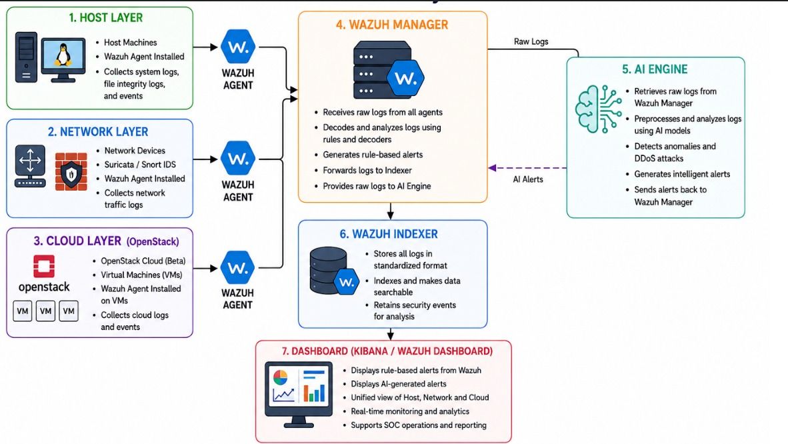

# System Architecture

## Overview

The proposed system is a **multi-layer Security Information and Event Management (SIEM)** solution that integrates **Wazuh**, **Suricata**, **OpenStack**, and **Artificial Intelligence (AI)** to provide centralized security monitoring and intelligent threat detection across **Host**, **Network**, and **Cloud** environments.

The architecture combines traditional rule-based detection with machine learning-based anomaly detection to improve the identification of known and unknown cyber threats. Security logs collected from multiple layers are processed by the Wazuh Manager and AI Engine before being stored in the Wazuh Indexer and visualized through the Wazuh Dashboard.

---

## Architecture Diagram

---

# Architecture Components

## 1. Host Layer

The Host Layer consists of endpoint systems such as Windows and Linux machines. A Wazuh Agent is installed on each host to continuously monitor system activities and collect security-related logs.

### Responsibilities

- Monitor operating system events.
- Collect authentication logs.
- Monitor file integrity using File Integrity Monitoring (FIM).
- Detect unauthorized file modifications.
- Collect process execution logs.
- Monitor user login and logout events.
- Forward collected logs securely to the Wazuh Manager.

### Collected Data

- System Logs
- Authentication Logs
- File Integrity Monitoring (FIM) Events
- Process Execution Logs
- User Activity Logs

---

## 2. Network Layer

The Network Layer is responsible for monitoring network traffic and detecting malicious activities. Suricata Intrusion Detection System (IDS) is deployed to inspect packets and generate alerts for suspicious network behavior.

A Wazuh Agent collects Suricata alerts and forwards them to the Wazuh Manager.

### Responsibilities

- Monitor network traffic.
- Detect intrusion attempts.
- Detect port scanning activities.
- Detect brute-force attacks.
- Detect Denial-of-Service (DoS/DDoS) attacks.
- Analyze packet information.
- Forward network security logs to the Wazuh Manager.

### Collected Data

- Suricata Alerts
- Network Traffic Logs
- IDS Events
- Connection Logs
- Packet Metadata

---

## 3. Cloud Layer (OpenStack)

The Cloud Layer consists of virtual machines deployed in an OpenStack environment. Each virtual machine contains a Wazuh Agent responsible for collecting operating system and cloud-related security logs.

This layer enables centralized monitoring of cloud infrastructure alongside host and network environments.

### Responsibilities

- Monitor cloud virtual machines.
- Collect cloud service logs.
- Monitor authentication events.
- Collect operating system logs.
- Monitor cloud activities.
- Forward collected logs to the Wazuh Manager.

### Collected Data

- OpenStack Logs
- Virtual Machine Logs
- Authentication Logs
- System Events
- Cloud Service Logs

---

## 4. Wazuh Agent

The Wazuh Agent is deployed on every monitored endpoint across the Host, Network, and Cloud layers.

Its primary role is to collect security logs and securely transmit them to the Wazuh Manager.

### Responsibilities

- Collect endpoint logs.
- Monitor file integrity.
- Monitor system processes.
- Collect authentication events.
- Encrypt communication with the Wazuh Manager.
- Forward logs in real time.

---

## 5. Wazuh Manager

The Wazuh Manager is the core component of the proposed SIEM architecture. It receives logs from all registered Wazuh Agents and performs centralized analysis using built-in decoders and security rules.

In addition to rule-based detection, the Wazuh Manager forwards raw logs to the AI Engine for advanced machine learning analysis.

### Responsibilities

- Receive logs from all Wazuh Agents.
- Decode raw security events.
- Normalize log formats.
- Apply built-in security rules.
- Apply custom detection rules.
- Generate rule-based alerts.
- Forward logs to the Wazuh Indexer.
- Provide raw logs to the AI Engine.

### Input Sources

- Host Layer
- Network Layer
- Cloud Layer

### Output

- Rule-Based Security Alerts
- Raw Logs for AI Processing
- Indexed Security Events

---

## 6. AI Engine

The AI Engine extends the capabilities of the Wazuh SIEM by performing intelligent anomaly detection using machine learning techniques.

Raw logs received from the Wazuh Manager are preprocessed, transformed into features, and analyzed using trained machine learning models. The AI Engine identifies suspicious behavior that may not be detected by traditional rule-based mechanisms.

After analysis, AI-generated alerts are sent back to the Wazuh Manager, allowing them to appear alongside rule-based alerts on the dashboard.

### Responsibilities

- Retrieve raw logs from the Wazuh Manager.
- Preprocess security logs.
- Perform feature extraction.
- Apply trained machine learning models.
- Detect anomalies and suspicious behavior.
- Generate AI-based security alerts.
- Send AI-generated alerts back to the Wazuh Manager.

### Machine Learning Models

| Security Layer | Machine Learning Model |
|----------------|------------------------|
| Host Layer | Isolation Forest |
| Network Layer | Random Forest |
| Cloud Layer | Random Forest |

---

## 7. Wazuh Indexer

The Wazuh Indexer stores, indexes, and manages all processed security logs generated by the Wazuh Manager.

It enables fast searching, efficient storage, and historical analysis of security events while providing data to the Wazuh Dashboard.

### Responsibilities

- Store processed logs.
- Index security events.
- Enable fast searching.
- Maintain historical security records.
- Supply indexed data to the dashboard.

---

## 8. Wazuh Dashboard

The Wazuh Dashboard provides a centralized interface for monitoring security events collected from the Host, Network, and Cloud layers.

The dashboard displays both traditional Wazuh alerts and AI-generated alerts, enabling security analysts to investigate incidents and monitor infrastructure from a single location.

### Dashboard Features

- Real-time security monitoring.
- Host activity visualization.
- Network monitoring.
- Cloud monitoring.
- AI-generated alerts.
- Rule-based alerts.
- Interactive dashboards.
- Security event filtering.
- Threat investigation.

---

# End-to-End Workflow

The proposed system begins by deploying Wazuh Agents on Host machines, Network monitoring systems, and Cloud virtual machines. These agents continuously collect security logs and transmit them securely to the Wazuh Manager.

The Wazuh Manager processes incoming logs by decoding, normalizing, and analyzing them using predefined security rules. Rule-based alerts are generated whenever suspicious activities match existing detection rules.

Simultaneously, raw logs are forwarded to the AI Engine, where they are preprocessed and analyzed using trained machine learning models. The AI Engine detects anomalous behavior, identifies potential cyber threats, and generates AI-based alerts.

These AI-generated alerts are sent back to the Wazuh Manager, where they are integrated with rule-based alerts before being forwarded to the Wazuh Indexer. The Wazuh Indexer stores and indexes all processed events, allowing the Wazuh Dashboard to retrieve and visualize security information in real time.

The final result is a unified security monitoring platform capable of detecting threats across Host, Network, and Cloud environments using both traditional SIEM techniques and intelligent AI-based anomaly detection.
