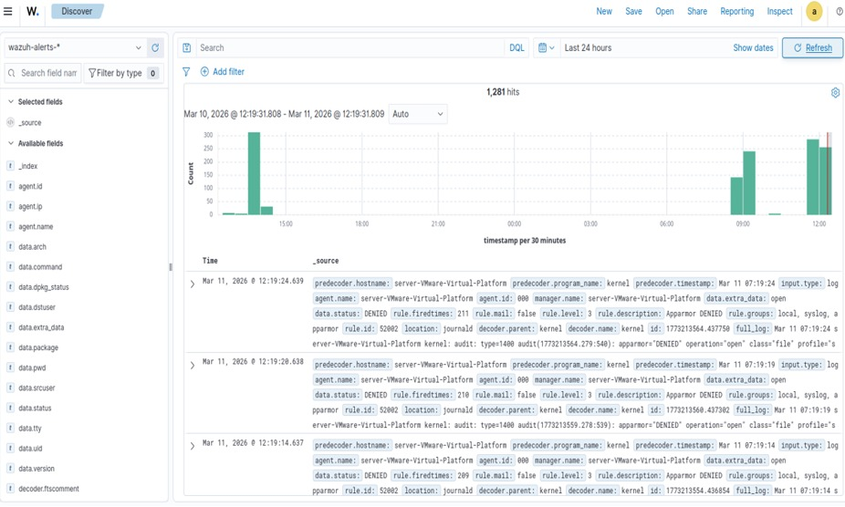
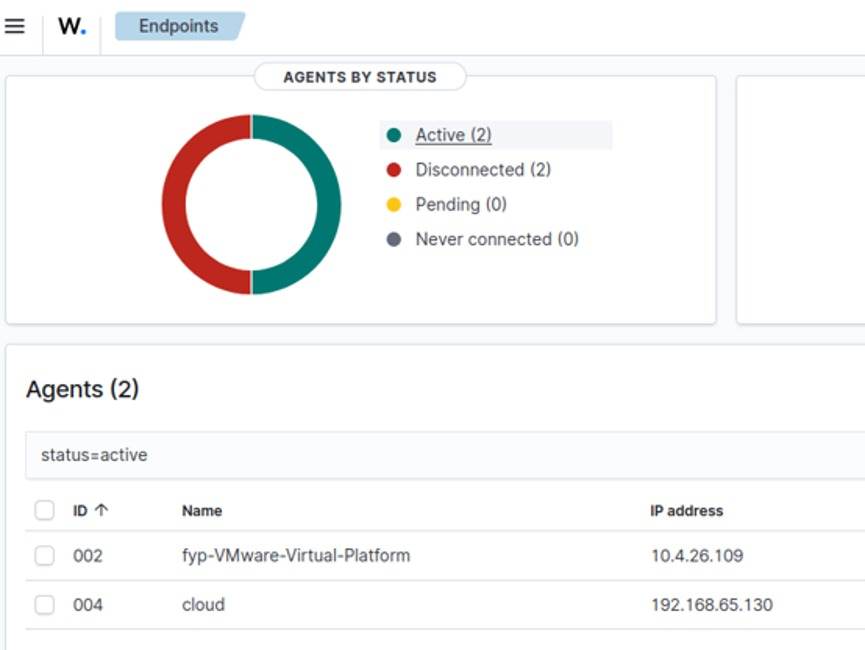

# Dashboard Screenshots

The following screenshots demonstrate the successful deployment and operation of the proposed **Enhancing Wazuh SIEM with Cross-Layer Security and AI-Based Anomaly Detection** system. They show connected agents, real-time log collection, and centralized security monitoring through the Wazuh Dashboard.

---

## Connected Wazuh Agents

This dashboard shows all endpoints that are successfully connected to the Wazuh Manager. It displays the status of each Wazuh Agent, including active and disconnected agents, along with their agent ID, hostname, and IP address. This confirms that the Host, Network, and Cloud systems are successfully registered and communicating with the Wazuh Server.

---

## Security Event Dashboard

This dashboard provides a real-time overview of security events collected from the monitored systems. It displays the total number of events, event timeline, and detailed log entries generated by Wazuh. Security analysts can search, filter, and inspect logs to investigate suspicious activities and monitor system behavior.
